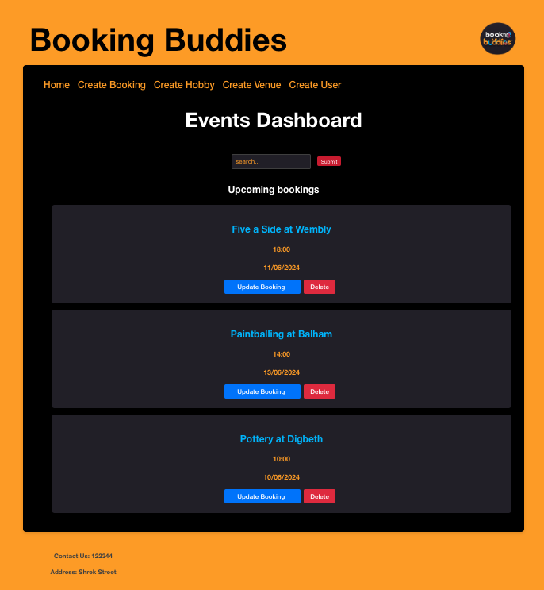
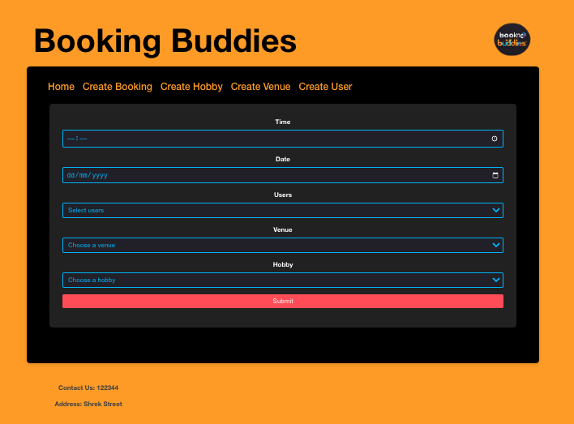
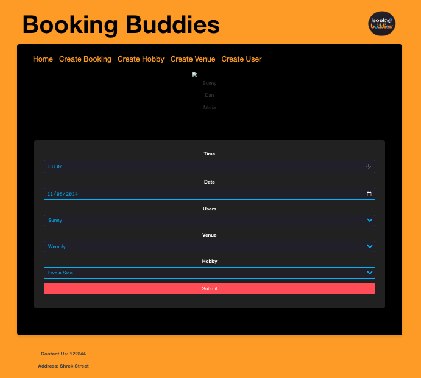

# Booking Buddies

Booking Buddies, because your sofa has seen enough of you.

## Description
This project was built using the Booking Buddies API, providing a dynamic frontend from the admin/event planner's point of view, this way ensures that other users can't manipulate or remove other user's data. Here the admin can create, update and delete bookings. 


## Features

Here are a few of the features included within our application.

### MVP:

* Display each booking from the API on the website's main page (dashboard):
    * Implement CRUD functionality into booking component
* Update a booking by:
    * Adding/removing users
    * Changing the date/time
    * Changing the venue
    * Changing the hobby
* Create a nav bar containing each webpage
* Add styling

### Extensions:

* Provide a webpage for creating, updating and deleting Hobbies, Venues and Users
* Manage a Hobby, Venue or User by:
    * Changing the User's/Hobby's/Venue's name
    * Changing the Venue's location
    * Changing the Venue's capacity
* Assign a user a Hobby
* Assign multiple users when creating a booking
* Add functionality to searchbar's for each component
* Remove a user from a booking
* Create a sort function that lists upcoming bookings by date/time

## WebFlow





## Bugs

* Couldn't patch multiple attributes of a booking simultaneously
* Since we changed the format of the input to the date picker, couldn't pre-populate the date input on the updateBooking form. 
* When submitting an updated booking, the newly updated booking wasn't rendering on the dashboard without refreshing
* Couldn't load data into UpdateBooking component with loader function


## Troubles

* Variable renaming was the solution for a lot of issues
* Needed specific paths for each booking
* Needed helper files , rather than one 'God' container
* Drawing component diagram, we felt like we were adding too many pages


## Installation

1. **Clone the repository**:

   ```sh
   git clone git@github.com:ornerykiwi/booking_buddies_frontend.git
   cd week_11_frontend_project
   ```

2. **Install packages and run front end server**:

    Install packages and run server in the terminal using the following command:

    ```sh
        npm i
        npm run dev
    ```

3. **Build and Run the Application in IntelliJ**

The API will then be available at **http://localhost:5173**

## Technologies and Tools

* JavaScript/React
* HTML/CSS

## Dependencies:

* react
* react-dom
* react-router-dom

## Contributors:

* [Robbie Mcilwaine](https://github.com/robbiemcilwaine)
* [Adil Iqbal](https://github.com/AdilIqbal95)
* [Dena Shiranipour](https://github.com/dena-shiranipour)
* [Charisma Khawaja](https://github.com/ornerykiwi)
